# Module 7 - Spring REST using Spring Boot 3

---

## Table of Contents

1. [Module Overview](#module-overview)
2. [Learning Objectives](#learning-objectives)
3. [Topic 1: Introduction to Spring REST and Spring Boot 3](#topic-1-introduction-to-spring-rest-and-spring-boot-3)
4. [Topic 2: Building REST Controllers](#topic-2-building-rest-controllers)
5. [Topic 3: Request and Response Handling](#topic-3-request-and-response-handling)
6. [Topic 4: DTOs](#topic-4-dtos)
7. [Topic 5: REST CRUD Operations](#topic-5-rest-crud-operations)
8. [Topic 6: HATEOAS](#topic-6-hateoas)
9. [Topic 7: Content Negotiation](#topic-7-content-negotiation)
10. [Topic 8: Spring Boot Actuator](#topic-8-spring-boot-actuator)
11. [Topic 9: Security](#topic-9-security)
12. [Topic 10: Testing REST APIs](#topic-10-testing-rest-apis)
13. [Topic 11: Swagger / OpenAPI](#topic-11-swagger--openapi)
14. [Summary Section](#summary-section)
15. [Spring Boot REST Architecture](#spring-boot-rest-architecture)
16. [Complete Request Lifecycle](#complete-request-lifecycle)
17. [HTTP Status Codes](#http-status-codes)
18. [REST API Best Practices](#rest-api-best-practices)
19. [Interview Questions](#interview-questions)
20. [Quick Revision](#quick-revision)
21. [Cheat Sheet](#cheat-sheet)

---

## Module Overview

REST is an architectural style for building networked applications where everything important is modeled as a resource and manipulated through standard HTTP semantics. It exists to make distributed systems simpler to evolve, easier to scale, and interoperable across platforms.

Spring Boot is used because it reduces boilerplate and gives production-ready defaults for web, validation, data access, observability, and security. In real systems, this lets teams move from idea to deployable API quickly while preserving architecture quality.

Typical real-world REST API use cases:

- E-commerce catalog, orders, and payments
- Banking account and transaction services
- Healthcare appointment and patient records workflows
- Logistics shipment tracking
- SaaS multi-tenant backend platforms

> **Why this module matters:** Most enterprise backend systems today expose HTTP APIs. Mastering Spring Boot REST directly improves your ability to design maintainable and secure backend services.

---

## Learning Objectives

By the end of this module, you should be able to:

1. Design RESTful endpoints using resource-centric URI patterns.
2. Implement controllers, service layers, and repository integration in Spring Boot 3.
3. Handle request binding, response shaping, validation, and global exception handling.
4. Use DTOs and mapping strategies to decouple API contracts from persistence entities.
5. Implement full CRUD with concurrency control and proper HTTP semantics.
6. Apply HATEOAS for discoverable APIs when workflow navigation matters.
7. Configure content negotiation for JSON/XML and custom media types.
8. Monitor APIs with Actuator health, metrics, and custom telemetry.
9. Secure APIs with Spring Security, roles, JWT, CORS, and CSRF strategy.
10. Test APIs using unit, slice, and integration testing with coverage tracking.
11. Document APIs with OpenAPI/Swagger for consumers and internal teams.

---

# Topic 1: Introduction to Spring REST and Spring Boot 3

## 1.1 REST Architecture

### What
REST (Representational State Transfer) is a style where the server exposes resources via URIs and clients interact using standard HTTP verbs.

### Why
It standardizes communication, minimizes coupling, and allows independent evolution of client and server.

### Core REST Concepts

| Concept | Meaning | Example |
|---|---|---|
| Resource | Business object exposed by API | `Product`, `Order` |
| URI | Identifier of resource | `/api/v1/products/42` |
| Representation | Data format of resource | JSON or XML |
| Stateless interaction | Request has all context | JWT in each request |

## 1.2 REST Constraints

| Constraint | Why it exists | Practical effect |
|---|---|---|
| Client-Server | Separation of concerns | UI and backend evolve independently |
| Stateless | Horizontal scalability | No server session dependency |
| Cacheable | Performance efficiency | Reuse GET responses where valid |
| Uniform Interface | Standardized interaction | Consistent HTTP semantics |
| Layered System | Modular architecture | API gateway, service, DB separation |
| Code-on-Demand (optional) | Extend client behavior | Rare in backend APIs |

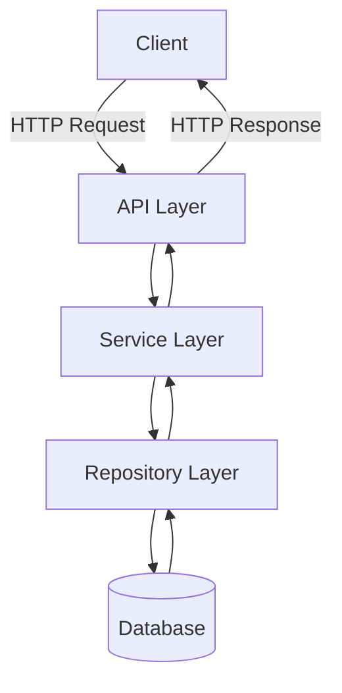

## 1.3 HTTP Methods and Semantics

| Method | Intent | Idempotent | Typical Use |
|---|---|---|---|
| GET | Read | Yes | Fetch resources |
| POST | Create/Action | No | Create new resource |
| PUT | Full update | Yes | Replace resource |
| PATCH | Partial update | Usually no | Modify selected fields |
| DELETE | Remove | Yes | Delete resource |

## 1.4 Spring Boot 3 Overview

Spring Boot 3 is built on Spring Framework 6 and Jakarta EE 10 namespaces (`jakarta.*`). It is optimized for modern Java versions and production observability.

### What’s New in Spring Boot 3

- Jakarta namespace migration (`javax.*` to `jakarta.*`)
- Java 17+ baseline (works well with Java 21)
- Better AOT/native image support
- Improved Micrometer observability
- Updated ecosystem alignment (Spring Security 6, Hibernate 6)

## 1.5 REST vs SOAP

| Aspect | REST | SOAP |
|---|---|---|
| Data format | JSON/XML | XML only |
| Protocol | HTTP-centric | Protocol + envelope contract |
| Performance | Usually lighter | Usually heavier |
| Learning curve | Easier | Steeper |
| Contract style | Flexible | Strict WSDL |
| Best fit | Web/mobile APIs | Legacy enterprise integrations |

## 1.6 Lifecycle Flow

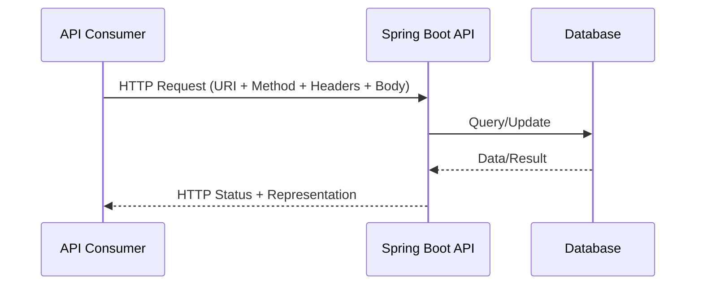

---

# Topic 2: Building REST Controllers

## 2.1 Core Controller Annotations

| Annotation | Purpose | Why it matters |
|---|---|---|
| `@RestController` | Combines `@Controller` + `@ResponseBody` | Returns JSON/XML directly |
| `@Controller` | MVC controller | Used for view rendering |
| `@RequestMapping` | Base path and shared mapping | Reduces repeated mappings |
| `@GetMapping` | GET endpoint | Read operations |
| `@PostMapping` | POST endpoint | Create operations |
| `@PutMapping` | PUT endpoint | Replace updates |
| `@DeleteMapping` | DELETE endpoint | Remove operations |
| `@ResponseBody` | Write return value to response body | Needed in plain `@Controller` |
| `ResponseEntity<T>` | Control body + status + headers | Precise HTTP contract |

## 2.2 Request Mapping Flow

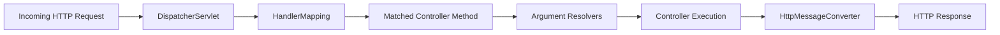

## 2.3 Controller Architecture

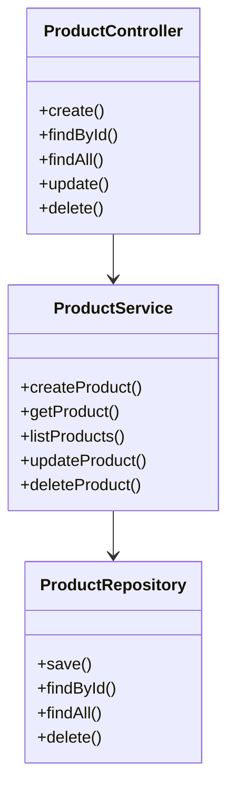

## 2.4 Complete CRUD Controller Example

```java
package com.example.catalog.api;

import com.example.catalog.service.ProductService;
import jakarta.validation.Valid;
import java.net.URI;
import java.util.List;
import org.springframework.http.ResponseEntity;
import org.springframework.web.bind.annotation.DeleteMapping;
import org.springframework.web.bind.annotation.GetMapping;
import org.springframework.web.bind.annotation.PathVariable;
import org.springframework.web.bind.annotation.PostMapping;
import org.springframework.web.bind.annotation.PutMapping;
import org.springframework.web.bind.annotation.RequestBody;
import org.springframework.web.bind.annotation.RequestMapping;
import org.springframework.web.bind.annotation.RestController;
import org.springframework.web.servlet.support.ServletUriComponentsBuilder;

@RestController
@RequestMapping("/api/v1/products")
public class ProductController {

    private final ProductService productService;

    public ProductController(ProductService productService) {
        this.productService = productService;
    }

    @PostMapping
    public ResponseEntity<ProductResponse> create(@Valid @RequestBody ProductCreateRequest request) {
        ProductResponse created = productService.createProduct(request);
        URI location = ServletUriComponentsBuilder.fromCurrentRequest()
                .path("/{id}")
                .buildAndExpand(created.id())
                .toUri();
        return ResponseEntity.created(location).body(created);
    }

    @GetMapping("/{id}")
    public ResponseEntity<ProductResponse> findById(@PathVariable Long id) {
        return ResponseEntity.ok(productService.getProduct(id));
    }

    @GetMapping
    public ResponseEntity<List<ProductResponse>> findAll() {
        return ResponseEntity.ok(productService.listProducts());
    }

    @PutMapping("/{id}")
    public ResponseEntity<ProductResponse> update(@PathVariable Long id, @Valid @RequestBody ProductUpdateRequest request) {
        return ResponseEntity.ok(productService.updateProduct(id, request));
    }

    @DeleteMapping("/{id}")
    public ResponseEntity<Void> delete(@PathVariable Long id) {
        productService.deleteProduct(id);
        return ResponseEntity.noContent().build();
    }
}
```

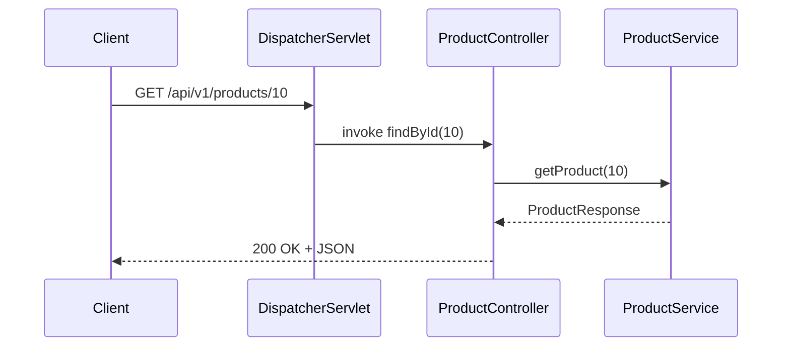

### Best Practices

- Keep controllers thin and delegate business logic to services.
- Return `ResponseEntity` for explicit status/header control.
- Use versioned base path like `/api/v1`.

### Common Mistakes

- Embedding business logic in controller methods.
- Returning JPA entities directly to clients.
- Ignoring proper HTTP status codes.

---

# Topic 3: Request and Response Handling

## 3.1 Request Binding Annotations

| Annotation | Binds from | Typical case |
|---|---|---|
| `@PathVariable` | URI segment | `/products/{id}` |
| `@RequestParam` | Query parameter | `?page=0&size=20` |
| `@RequestBody` | Request body | JSON payload |
| `@RequestHeader` | Header value | `X-Correlation-Id` |

## 3.2 Response Control

| Tool | Why use it |
|---|---|
| `@ResponseStatus` | Fixed status for method or exception |
| `ResponseEntity` | Dynamic status + headers + body |
| `HttpStatus` | Clear status constants |
| Headers | Caching, tracing, content controls |

## 3.3 Global Exception Handling

### Why
Centralized error handling creates consistent API contracts and improves observability and client experience.

### How

```java
package com.example.catalog.api;

import java.time.Instant;
import java.util.Map;
import org.springframework.http.HttpStatus;
import org.springframework.http.ResponseEntity;
import org.springframework.validation.FieldError;
import org.springframework.web.bind.MethodArgumentNotValidException;
import org.springframework.web.bind.annotation.ControllerAdvice;
import org.springframework.web.bind.annotation.ExceptionHandler;

@ControllerAdvice
public class GlobalExceptionHandler {

    @ExceptionHandler(ResourceNotFoundException.class)
    public ResponseEntity<ApiError> handleNotFound(ResourceNotFoundException ex) {
        ApiError error = new ApiError(Instant.now(), HttpStatus.NOT_FOUND.value(), "Not Found", ex.getMessage(), null);
        return ResponseEntity.status(HttpStatus.NOT_FOUND).body(error);
    }

    @ExceptionHandler(MethodArgumentNotValidException.class)
    public ResponseEntity<ApiError> handleValidation(MethodArgumentNotValidException ex) {
        Map<String, String> fieldErrors = ex.getBindingResult()
                .getFieldErrors()
                .stream()
                .collect(java.util.stream.Collectors.toMap(FieldError::getField, FieldError::getDefaultMessage, (a, b) -> a));
        ApiError error = new ApiError(Instant.now(), HttpStatus.BAD_REQUEST.value(), "Validation Failed", "Invalid request body", fieldErrors);
        return ResponseEntity.badRequest().body(error);
    }

    @ExceptionHandler(Exception.class)
    public ResponseEntity<ApiError> handleGeneric(Exception ex) {
        ApiError error = new ApiError(Instant.now(), HttpStatus.INTERNAL_SERVER_ERROR.value(), "Internal Error", "Unexpected server error", null);
        return ResponseEntity.status(HttpStatus.INTERNAL_SERVER_ERROR).body(error);
    }
}
```

```java
package com.example.catalog.api;

import java.time.Instant;
import java.util.Map;

public record ApiError(
        Instant timestamp,
        int status,
        String error,
        String message,
        Map<String, String> fieldErrors
) {}
```

## 3.4 Request Processing Flow

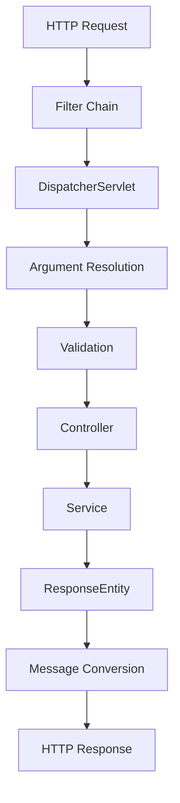

### Interview Perspective

- Prefer `ResponseEntity` when status/headers vary per scenario.
- Use `@ControllerAdvice` to guarantee uniform error schema.

---

# Topic 4: DTOs

## 4.1 What and Why DTOs

DTO (Data Transfer Object) is a transport-focused object used to expose only required fields to API consumers.

Why DTOs exist:

- Prevent exposing internal entity structure.
- Maintain stable API contract even when DB model changes.
- Enforce security boundaries (hide sensitive fields).
- Support versioned payloads.

## 4.2 Entity vs DTO

| Aspect | Entity | DTO |
|---|---|---|
| Purpose | Persistence | API contract |
| Lifecycle | Managed by JPA | Immutable/simple transport object |
| Fields | DB-centric | Client-centric |
| Exposure | Internal | External |

## 4.3 Mapping Strategies

### Manual Mapping

- Maximum control
- Better performance predictability
- More boilerplate

### ModelMapper / MapStruct style tools

- Faster development
- Standardized conversion
- Requires careful configuration

```java
package com.example.catalog.mapper;

import com.example.catalog.domain.Product;
import com.example.catalog.api.ProductResponse;
import org.springframework.stereotype.Component;

@Component
public class ProductMapper {

    public ProductResponse toResponse(Product product) {
        return new ProductResponse(
                product.getId(),
                product.getName(),
                product.getPrice(),
                product.getCategory(),
                product.getUpdatedAt()
        );
    }
}
```

## 4.4 Jackson, Serialization, and Deserialization

| Term | Meaning |
|---|---|
| Serialization | Java object to JSON/XML |
| Deserialization | JSON/XML to Java object |

Useful Jackson annotations:

- `@JsonProperty`
- `@JsonInclude`
- `@JsonFormat`
- `@JsonIgnore`

## 4.5 DTO Versioning and Backward Compatibility

Approaches:

1. URI versioning: `/api/v1/products`
2. Header versioning: `Accept: application/vnd.catalog.v2+json`
3. Additive field evolution: only add optional fields, avoid removing existing fields suddenly.

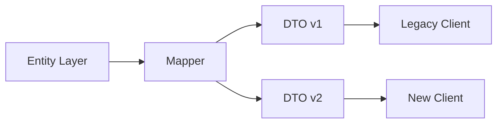

### Best Practices

- Use immutable DTOs (`record`) where possible.
- Separate request and response DTOs.
- Never return entity objects directly.

### Common Mistakes

- Reusing same DTO for create/update/read with conflicting constraints.
- Accidentally leaking audit/security fields.

---

# Topic 5: REST CRUD Operations

## 5.1 CRUD and HTTP Mapping

| Operation | Endpoint | Method | Success Status |
|---|---|---|---|
| Create | `/products` | POST | 201 |
| Read one | `/products/{id}` | GET | 200 |
| Read all | `/products` | GET | 200 |
| Update | `/products/{id}` | PUT/PATCH | 200/204 |
| Delete | `/products/{id}` | DELETE | 204 |

## 5.2 Validation

Key annotations:

- `@NotNull`
- `@NotBlank`
- `@Email`
- `@Size`
- `@Min`
- `@Max`

```java
package com.example.catalog.api;

import jakarta.validation.constraints.Max;
import jakarta.validation.constraints.Min;
import jakarta.validation.constraints.NotBlank;
import jakarta.validation.constraints.NotNull;
import jakarta.validation.constraints.Size;
import java.math.BigDecimal;

public record ProductCreateRequest(
        @NotBlank @Size(min = 2, max = 120) String name,
        @NotNull @Min(1) @Max(1_000_000) BigDecimal price,
        @NotBlank String category
) {}
```

## 5.3 Optimistic Locking and Concurrency

`@Version` helps prevent lost updates in concurrent writes.

```java
package com.example.catalog.domain;

import jakarta.persistence.Entity;
import jakarta.persistence.GeneratedValue;
import jakarta.persistence.GenerationType;
import jakarta.persistence.Id;
import jakarta.persistence.Version;
import java.math.BigDecimal;
import java.time.Instant;

@Entity
public class Product {

    @Id
    @GeneratedValue(strategy = GenerationType.IDENTITY)
    private Long id;
    private String name;
    private BigDecimal price;
    private String category;
    private Instant updatedAt;

    @Version
    private Long version;

    public void update(String name, BigDecimal price, String category) {
        this.name = name;
        this.price = price;
        this.category = category;
        this.updatedAt = Instant.now();
    }

    public Long getId() { return id; }
    public String getName() { return name; }
    public BigDecimal getPrice() { return price; }
    public String getCategory() { return category; }
    public Instant getUpdatedAt() { return updatedAt; }
}
```

## 5.4 CRUD Service and Repository Flow

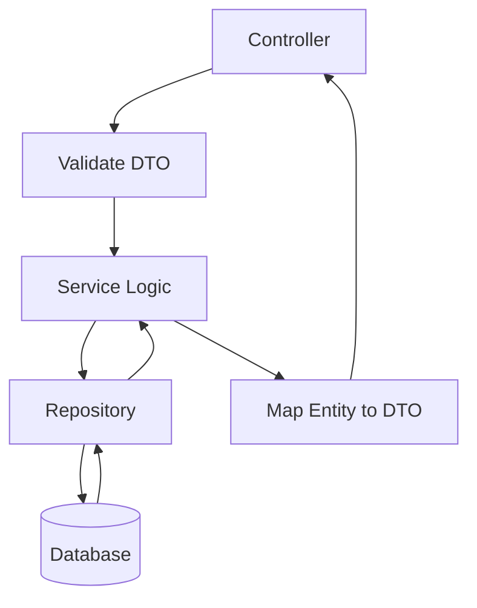

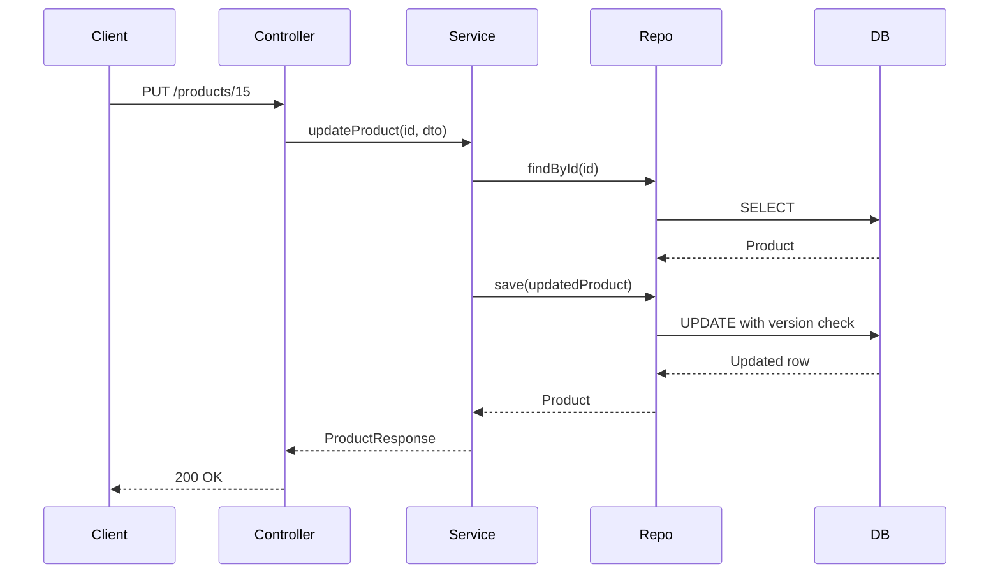

### Advantages

- Predictable API behavior
- Better client integration
- Data integrity with validation + locking

### Disadvantages

- More layers and DTO mapping overhead
- Requires disciplined contract management

---

# Topic 6: HATEOAS

## 6.1 What and Why

HATEOAS (Hypermedia as the Engine of Application State) means responses contain links guiding clients to valid next actions. It reduces hardcoded client navigation logic.

## 6.2 Core Spring HATEOAS Types

| Type | Purpose |
|---|---|
| `EntityModel<T>` | Wrap one resource + links |
| `CollectionModel<T>` | Wrap list + links |
| `RepresentationModel` | Base hypermedia model |
| `linkTo` / `methodOn` | Link construction |

## 6.3 Before vs After HATEOAS

| Without HATEOAS | With HATEOAS |
|---|---|
| Client guesses next endpoints | Client follows links |
| Tight coupling to URI patterns | Discoverable navigation |
| Higher break risk on URI change | Better evolvability |

## 6.4 Implementation Example

```java
package com.example.catalog.api;

import static org.springframework.hateoas.server.mvc.WebMvcLinkBuilder.linkTo;
import static org.springframework.hateoas.server.mvc.WebMvcLinkBuilder.methodOn;

import org.springframework.hateoas.EntityModel;
import org.springframework.stereotype.Component;

@Component
public class ProductModelAssembler {

    public EntityModel<ProductResponse> toModel(ProductResponse product) {
        return EntityModel.of(product,
                linkTo(methodOn(ProductController.class).findById(product.id())).withSelfRel(),
                linkTo(methodOn(ProductController.class).findAll()).withRel("products"),
                linkTo(methodOn(ProductController.class).delete(product.id())).withRel("delete"));
    }
}
```

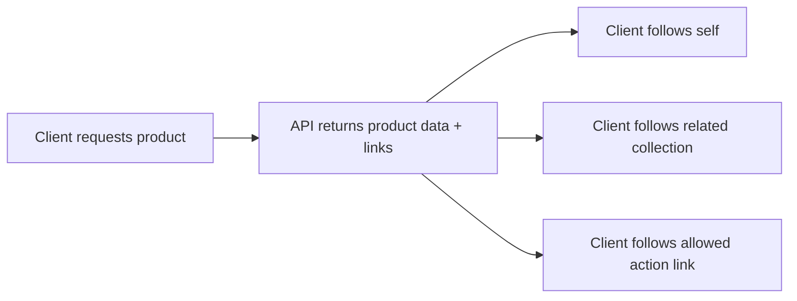

### When to Use

- Workflow-driven APIs with many state transitions
- APIs consumed by generic or long-lived clients

### When Not Necessary

- Very simple internal APIs with stable direct contracts

---

# Topic 7: Content Negotiation

## 7.1 What and Why

Content negotiation allows server and client to agree on representation format. It supports multiple consumers with different needs without duplicating business logic.

## 7.2 Key Concepts

| Concept | Description |
|---|---|
| Media Type | Format identifier, e.g., `application/json` |
| `Accept` header | Preferred response format from client |
| `Content-Type` header | Format of request body |
| `produces` | What endpoint can return |
| `consumes` | What endpoint accepts |

## 7.3 Controller Example

```java
package com.example.catalog.api;

import org.springframework.http.MediaType;
import org.springframework.web.bind.annotation.GetMapping;
import org.springframework.web.bind.annotation.RequestMapping;
import org.springframework.web.bind.annotation.RestController;

@RestController
@RequestMapping("/api/v1/reports")
public class ReportController {

    @GetMapping(value = "/daily", produces = {MediaType.APPLICATION_JSON_VALUE, MediaType.APPLICATION_XML_VALUE})
    public DailyReportResponse getDailyReport() {
        return new DailyReportResponse("2026-07-19", 124, 2_145_000.0);
    }
}
```

## 7.4 Request Flow

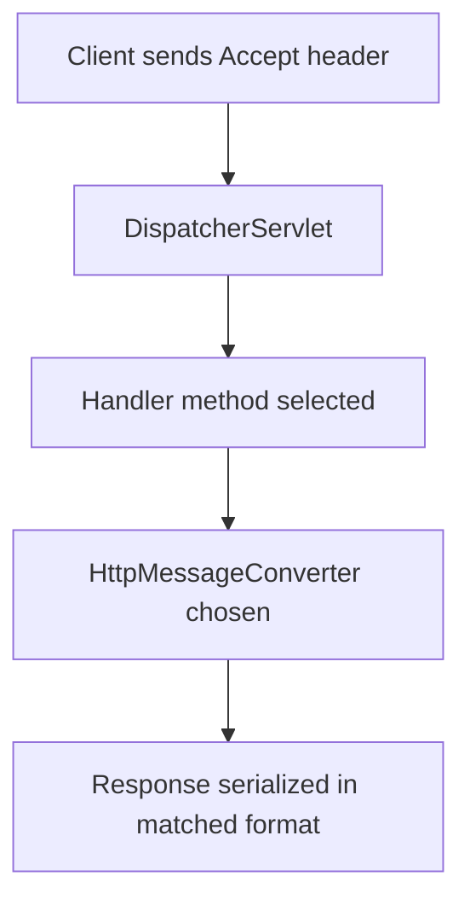

## 7.5 Postman Examples

| Request | Headers | Response |
|---|---|---|
| `GET /api/v1/reports/daily` | `Accept: application/json` | JSON |
| `GET /api/v1/reports/daily` | `Accept: application/xml` | XML |
| `POST /api/v1/products` | `Content-Type: application/json` | Created/Validation error |

### Common Mistakes

- Missing XML converter dependency but expecting XML output.
- Inconsistent `consumes`/`produces` declarations.
- Ignoring `415 Unsupported Media Type`.

---

# Topic 8: Spring Boot Actuator

## 8.1 Why Actuator Exists

Production APIs need operational visibility: health, metrics, mappings, and runtime signals for debugging and scaling decisions.

## 8.2 Core Endpoints

| Endpoint | Purpose |
|---|---|
| `/actuator/health` | Liveness/readiness status |
| `/actuator/metrics` | Metric catalog and values |
| `/actuator/info` | Build/app metadata |
| `/actuator/beans` | Spring bean graph |
| `/actuator/mappings` | Endpoint mappings |

## 8.3 Architecture

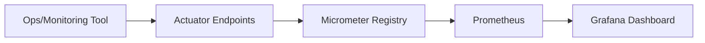

## 8.4 Custom Metrics with MeterRegistry

```java
package com.example.catalog.metrics;

import io.micrometer.core.instrument.Counter;
import io.micrometer.core.instrument.MeterRegistry;
import org.springframework.stereotype.Component;

@Component
public class CheckoutMetrics {

    private final Counter checkoutSuccessCounter;

    public CheckoutMetrics(MeterRegistry meterRegistry) {
        this.checkoutSuccessCounter = Counter.builder("checkout.success.count")
                .description("Total successful checkouts")
                .register(meterRegistry);
    }

    public void incrementSuccess() {
        checkoutSuccessCounter.increment();
    }
}
```

## 8.5 Security Considerations

- Expose only needed actuator endpoints in production.
- Restrict management endpoints with authentication and network policy.
- Avoid leaking sensitive environment/config values.

---

# Topic 9: Security

## 9.1 Core Concepts

| Concept | Meaning |
|---|---|
| Authentication | Who you are |
| Authorization | What you can do |
| Role | Grouped permission set |
| Filter chain | Request security pipeline |

## 9.2 Spring Security with JWT

### Why JWT

- Stateless authentication for horizontal scaling
- Suitable for APIs consumed by web/mobile clients

### Security Filter Chain Example

```java
package com.example.catalog.config;

import org.springframework.context.annotation.Bean;
import org.springframework.context.annotation.Configuration;
import org.springframework.http.HttpMethod;
import org.springframework.security.config.Customizer;
import org.springframework.security.config.annotation.web.builders.HttpSecurity;
import org.springframework.security.config.http.SessionCreationPolicy;
import org.springframework.security.web.SecurityFilterChain;

@Configuration
public class SecurityConfig {

    @Bean
    SecurityFilterChain securityFilterChain(HttpSecurity http) throws Exception {
        http
                .csrf(csrf -> csrf.disable())
                .cors(Customizer.withDefaults())
                .sessionManagement(session -> session.sessionCreationPolicy(SessionCreationPolicy.STATELESS))
                .authorizeHttpRequests(auth -> auth
                        .requestMatchers("/actuator/health", "/v3/api-docs/**", "/swagger-ui/**").permitAll()
                        .requestMatchers(HttpMethod.GET, "/api/v1/products/**").hasAnyRole("USER", "ADMIN")
                        .requestMatchers("/api/v1/products/**").hasRole("ADMIN")
                        .anyRequest().authenticated()
                )
                .httpBasic(Customizer.withDefaults());
        return http.build();
    }
}
```

## 9.3 Authentication and JWT Flow

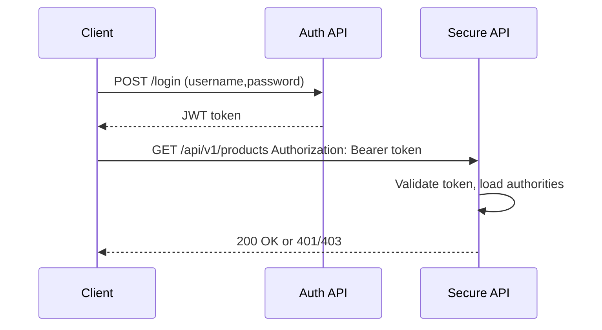

## 9.4 CORS and CSRF

| Topic | API Guidance |
|---|---|
| CORS | Explicitly allow trusted origins, methods, headers |
| CSRF | Disable for stateless token APIs; keep enabled for cookie-session apps |

## 9.5 Common Mistakes

- Hardcoding secrets in source code
- Using broad `permitAll` in production
- Returning overly detailed auth error data
- Missing token expiration/rotation strategy

---

# Topic 10: Testing REST APIs

## 10.1 Why Testing Matters

REST APIs are contracts. Tests protect behavior, prevent regressions, and allow safe refactoring.

## 10.2 Testing Types

| Type | Scope | Tools |
|---|---|---|
| Unit | Single class with mocks | JUnit, Mockito |
| Web slice | Controller + MVC config | `@WebMvcTest`, MockMvc |
| Integration | Full context + DB | `@SpringBootTest` |
| Repository | Data layer behavior | `@DataJpaTest` |

## 10.3 MockMvc Example

```java
package com.example.catalog.api;

import static org.mockito.Mockito.when;
import static org.springframework.test.web.servlet.request.MockMvcRequestBuilders.get;
import static org.springframework.test.web.servlet.result.MockMvcResultMatchers.jsonPath;
import static org.springframework.test.web.servlet.result.MockMvcResultMatchers.status;

import com.example.catalog.service.ProductService;
import java.math.BigDecimal;
import java.time.Instant;
import org.junit.jupiter.api.Test;
import org.springframework.beans.factory.annotation.Autowired;
import org.springframework.boot.test.autoconfigure.web.servlet.WebMvcTest;
import org.springframework.boot.test.mock.mockito.MockBean;
import org.springframework.test.web.servlet.MockMvc;

@WebMvcTest(ProductController.class)
class ProductControllerTest {

    @Autowired
    private MockMvc mockMvc;

    @MockBean
    private ProductService productService;

    @Test
    void shouldReturnProductById() throws Exception {
        ProductResponse response = new ProductResponse(10L, "Keyboard", new BigDecimal("2999"), "Electronics", Instant.now());
        when(productService.getProduct(10L)).thenReturn(response);

        mockMvc.perform(get("/api/v1/products/10"))
                .andExpect(status().isOk())
                .andExpect(jsonPath("$.id").value(10))
                .andExpect(jsonPath("$.name").value("Keyboard"));
    }
}
```

## 10.4 Integration Test Example

```java
package com.example.catalog;

import static org.springframework.test.web.servlet.request.MockMvcRequestBuilders.get;
import static org.springframework.test.web.servlet.result.MockMvcResultMatchers.status;

import org.junit.jupiter.api.Test;
import org.springframework.beans.factory.annotation.Autowired;
import org.springframework.boot.test.autoconfigure.web.servlet.AutoConfigureMockMvc;
import org.springframework.boot.test.context.SpringBootTest;
import org.springframework.test.web.servlet.MockMvc;

@SpringBootTest
@AutoConfigureMockMvc
class ProductApiIntegrationTest {

    @Autowired
    private MockMvc mockMvc;

    @Test
    void healthShouldBeAvailable() throws Exception {
        mockMvc.perform(get("/actuator/health"))
                .andExpect(status().isOk());
    }
}
```

## 10.5 Test Coverage

Use JaCoCo to detect untested critical paths. Prioritize meaningful coverage in:

- Error branches
- Validation paths
- Security boundaries
- Mapping logic

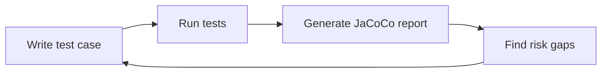

---

# Topic 11: Swagger / OpenAPI

## 11.1 What and Why

OpenAPI is a machine-readable API contract standard. Swagger UI renders that contract for humans. This enables faster onboarding, automated client generation, and better integration reliability.

## 11.2 Springdoc Integration

Common dependency:

```xml
<dependency>
    <groupId>org.springdoc</groupId>
    <artifactId>springdoc-openapi-starter-webmvc-ui</artifactId>
    <version>2.6.0</version>
</dependency>
```

## 11.3 Annotation Example

```java
package com.example.catalog.api;

import io.swagger.v3.oas.annotations.Operation;
import io.swagger.v3.oas.annotations.Parameter;
import io.swagger.v3.oas.annotations.media.Content;
import io.swagger.v3.oas.annotations.media.Schema;
import io.swagger.v3.oas.annotations.responses.ApiResponse;
import org.springframework.http.ResponseEntity;
import org.springframework.web.bind.annotation.GetMapping;
import org.springframework.web.bind.annotation.PathVariable;
import org.springframework.web.bind.annotation.RequestMapping;
import org.springframework.web.bind.annotation.RestController;

@RestController
@RequestMapping("/api/v1/products")
public class ProductDocController {

    @Operation(
            summary = "Fetch product by id",
            description = "Returns a product response for the provided identifier",
            responses = {
                    @ApiResponse(responseCode = "200", description = "Product found",
                            content = @Content(schema = @Schema(implementation = ProductResponse.class))),
                    @ApiResponse(responseCode = "404", description = "Product not found")
            }
    )
    @GetMapping("/{id}")
    public ResponseEntity<ProductResponse> findById(
            @Parameter(description = "Product identifier", required = true) @PathVariable Long id) {
        return ResponseEntity.ok().build();
    }
}
```

## 11.4 Documentation Flow

```mermaid
flowchart TD
    A[Controller + OpenAPI annotations] --> B[Springdoc scanner]
    B --> C[/v3/api-docs JSON]
    C --> D[Swagger UI]
    D --> E[Consumer explores and tests API]
```

### Best Practices

- Document error responses, not only success.
- Keep examples realistic and versioned.
- Synchronize docs with CI checks and release pipeline.

---

# Summary Section

1. REST provides scalable, standardized web API architecture through resource-driven design.
2. Spring Boot 3 accelerates API delivery with modern defaults and production-ready ecosystem support.
3. Controllers should orchestrate request/response mechanics, not business logic.
4. Request binding and global error handling create robust, consistent API contracts.
5. DTOs protect internal models and stabilize external contracts through mapping and versioning.
6. CRUD operations must align with HTTP semantics, validation, and concurrency safety.
7. HATEOAS improves discoverability for workflow-heavy APIs.
8. Content negotiation enables multi-format responses via media-type-aware conversion.
9. Actuator adds critical observability and operational confidence.
10. Security in REST requires strong authentication, authorization, token strategy, and transport hardening.
11. Testing and OpenAPI documentation are essential for reliability, maintainability, and consumer trust.

---

# Spring Boot REST Architecture

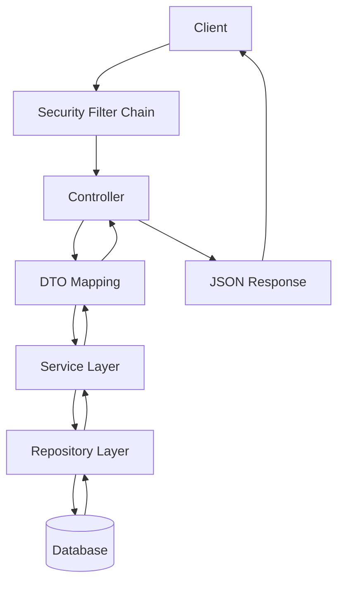

---

# Complete Request Lifecycle

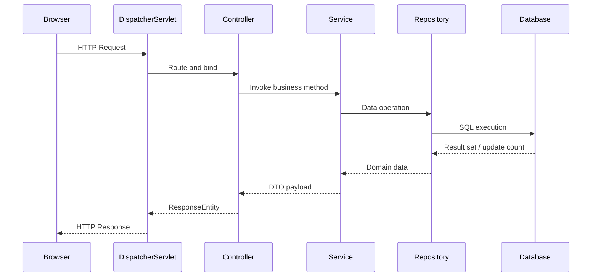

---

# HTTP Status Codes

| Code | Name | Meaning | Typical Usage |
|---|---|---|---|
| 200 | OK | Request successful | GET success, PUT success with body |
| 201 | Created | New resource created | POST create success |
| 202 | Accepted | Request accepted for async processing | Background jobs |
| 204 | No Content | Success with no response body | DELETE success, update without payload |
| 400 | Bad Request | Invalid request syntax/validation | Invalid DTO fields |
| 401 | Unauthorized | Authentication missing/invalid | No token or bad token |
| 403 | Forbidden | Authenticated but not allowed | Role/permission denied |
| 404 | Not Found | Resource does not exist | Missing ID |
| 405 | Method Not Allowed | HTTP verb not supported on endpoint | POST on GET-only URI |
| 409 | Conflict | State conflict with current resource | Duplicate key, version conflict |
| 415 | Unsupported Media Type | Unsupported request content type | Wrong `Content-Type` |
| 422 | Unprocessable Entity | Semantically invalid payload | Business rule violations |
| 500 | Internal Server Error | Unexpected server fault | Unhandled exception |
| 502 | Bad Gateway | Upstream service error via gateway | API gateway upstream failure |
| 503 | Service Unavailable | Temporarily unable to handle request | Maintenance, overload |

---

# REST API Best Practices

1. **Naming and URI design:** Use nouns, plural resources, and stable hierarchy (`/orders/{id}/items`).
2. **HTTP method semantics:** Match intent correctly; avoid action verbs in URIs.
3. **DTO usage:** Separate entity and API contracts; use request/response DTOs.
4. **Validation:** Enforce constraints at boundary using Bean Validation.
5. **Exception handling:** Centralize via `@ControllerAdvice` and structured error model.
6. **Logging:** Include request correlation IDs; avoid sensitive payload logging.
7. **Security:** Default deny, least privilege, strong auth, token expiry, secure secrets.
8. **Versioning:** Use URI or media-type versioning for non-backward-compatible changes.
9. **Swagger/OpenAPI:** Keep contract current and include examples and error schemas.
10. **Testing:** Cover happy path, edge cases, validation failures, and security scenarios.
11. **Pagination/filtering/sorting:** Required for list endpoints (`page`, `size`, `sort`).
12. **Rate limiting:** Protect system and ensure fair client usage.
13. **Caching:** Use cache headers/ETag for read-heavy resources.

> **Production rule:** Design APIs as long-lived contracts, not just code endpoints.

---

# Interview Questions

1. **What is REST?**  
   REST is an architectural style using resources, URIs, and HTTP semantics for scalable distributed systems.
2. **Why is REST stateless?**  
   To improve scalability and simplify server behavior by keeping request context on each call.
3. **Difference between PUT and PATCH?**  
   PUT replaces full resource; PATCH partially updates selected fields.
4. **Why use `ResponseEntity`?**  
   To control status, headers, and body explicitly.
5. **`@Controller` vs `@RestController`?**  
   `@RestController` returns body data directly; `@Controller` is MVC/view-oriented.
6. **What is content negotiation?**  
   Runtime selection of representation format based on headers like `Accept`.
7. **What does `@RequestBody` do?**  
   Deserializes request payload into Java object.
8. **What does `@PathVariable` do?**  
   Binds URI segment value to method parameter.
9. **Why global exception handling?**  
   For consistent error contracts and centralized fault policy.
10. **`@ControllerAdvice` use case?**  
    Handles exceptions across all controllers.
11. **Why DTOs instead of entities in responses?**  
    Prevents internal model leakage and stabilizes API contracts.
12. **Manual mapping vs mapper library?**  
    Manual gives control; library reduces boilerplate.
13. **What is optimistic locking?**  
    Concurrency control using version field to avoid lost updates.
14. **Purpose of `@Version`?**  
    Tracks row version and detects concurrent update conflicts.
15. **Why use validation annotations?**  
    To enforce input correctness at API boundaries.
16. **`@NotNull` vs `@NotBlank`?**  
    `@NotNull` checks null; `@NotBlank` checks non-null and non-whitespace for strings.
17. **When return 201?**  
    After successful resource creation.
18. **When return 204?**  
    On successful operation without response body.
19. **Difference 401 vs 403?**  
    401 means unauthenticated; 403 means authenticated but unauthorized.
20. **What is HATEOAS?**  
    Hypermedia-driven API where links guide next valid actions.
21. **Benefit of HATEOAS?**  
    Reduced client coupling to hardcoded URI structure.
22. **What is Spring HATEOAS `EntityModel`?**  
    Wrapper for resource data plus links.
23. **What is Actuator?**  
    Spring Boot module exposing operational endpoints for monitoring.
24. **Key Actuator endpoint for health?**  
    `/actuator/health`.
25. **What is Micrometer?**  
    Metrics facade used by Spring Boot for observability integration.
26. **What is a `Counter` metric?**  
    Monotonically increasing metric tracking event count.
27. **Why secure actuator endpoints?**  
    They can expose sensitive runtime details.
28. **What is Spring Security filter chain?**  
    Ordered filters that enforce authn/authz policies.
29. **HTTP Basic vs JWT?**  
    Basic sends credentials per request; JWT uses signed token claims.
30. **Why JWT for REST APIs?**  
    Stateless, scalable, and suitable for distributed services.
31. **What is Bearer token?**  
    Access token sent in `Authorization: Bearer <token>`.
32. **Role vs authority in Spring Security?**  
    Role is grouped authority convention; authority is fine-grained permission.
33. **Why configure CORS?**  
    To allow trusted browser origins to call API safely.
34. **When disable CSRF?**  
    In stateless token-based APIs without cookie session auth.
35. **`@WebMvcTest` purpose?**  
    Tests controller layer in isolation.
36. **`@SpringBootTest` purpose?**  
    Loads full application context for integration tests.
37. **What is `@MockBean`?**  
    Replaces Spring bean with Mockito mock in test context.
38. **Why use MockMvc?**  
    To test MVC endpoints without starting full server.
39. **What is JaCoCo?**  
    Code coverage tool for test completeness analysis.
40. **What is OpenAPI?**  
    Standard machine-readable API specification.
41. **Swagger vs OpenAPI?**  
    OpenAPI is spec; Swagger is tooling ecosystem around it.
42. **Why API documentation is critical?**  
    Reduces integration errors and onboarding friction.
43. **What is `@Operation` annotation?**  
    Documents endpoint purpose and behavior in OpenAPI.
44. **What is `@ApiResponse` annotation?**  
    Describes possible response codes and payloads.
45. **How to version APIs?**  
    URI versioning, media type versioning, or header-based strategy.
46. **Why not expose stack traces in errors?**  
    Security risk and poor consumer experience.
47. **What is idempotency?**  
    Repeating same request yields same state result.
48. **Which methods are idempotent?**  
    GET, PUT, DELETE are generally idempotent; POST usually is not.
49. **Why pagination on list endpoints?**  
    Prevents memory spikes and improves response times.
50. **What is 415 status used for?**  
    Unsupported request payload media type.
51. **What is 409 conflict in REST?**  
    Request conflicts with resource state, such as duplicate or version mismatch.
52. **Why separate service and controller layers?**  
    To isolate business logic and improve testability and maintainability.

---

# Quick Revision

## 10-Minute Exam Sprint

1. REST = resource-based API + HTTP semantics + statelessness.
2. Use nouns and plural URIs; align methods with CRUD semantics.
3. Controllers handle transport; services handle business rules.
4. Bind input via `@PathVariable`, `@RequestParam`, `@RequestBody`.
5. Always validate request DTOs with Bean Validation.
6. Centralize exceptions with `@ControllerAdvice`.
7. Use DTOs to protect entities and support versioned API contracts.
8. `ResponseEntity` gives full control over status/headers/body.
9. Content negotiation depends on `Accept` and `Content-Type`.
10. HATEOAS adds navigational links to reduce client coupling.
11. Actuator provides health, metrics, info, and mapping visibility.
12. Secure APIs with filter chain, roles, JWT, CORS, and strict endpoint rules.
13. Test with JUnit + Mockito + MockMvc + integration tests.
14. Document endpoints using Springdoc OpenAPI and Swagger UI.
15. Key status codes: 200, 201, 204, 400, 401, 403, 404, 409, 415, 500.

---

# Cheat Sheet

## A. Core REST Annotations

| Category | Annotations |
|---|---|
| Controller | `@RestController`, `@Controller`, `@RequestMapping` |
| Mapping | `@GetMapping`, `@PostMapping`, `@PutMapping`, `@PatchMapping`, `@DeleteMapping` |
| Request Binding | `@PathVariable`, `@RequestParam`, `@RequestBody`, `@RequestHeader` |
| Response | `@ResponseStatus`, `ResponseEntity` |
| Validation | `@Valid` |
| Exception Handling | `@ControllerAdvice`, `@ExceptionHandler` |

## B. HTTP Methods

| Method | CRUD | Idempotent |
|---|---|---|
| GET | Read | Yes |
| POST | Create | No |
| PUT | Update (full) | Yes |
| PATCH | Update (partial) | Depends |
| DELETE | Delete | Yes |

## C. Status Codes

| Success | Client Error | Server/Gateway |
|---|---|---|
| 200, 201, 202, 204 | 400, 401, 403, 404, 405, 409, 415, 422 | 500, 502, 503 |

## D. Validation Annotations

| Annotation | Purpose |
|---|---|
| `@NotNull` | Must not be null |
| `@NotBlank` | Non-empty non-whitespace string |
| `@Size` | Length bounds |
| `@Email` | Valid email format |
| `@Min`, `@Max` | Numeric range |

## E. Jackson Annotations

| Annotation | Usage |
|---|---|
| `@JsonProperty` | Custom property name |
| `@JsonIgnore` | Exclude field |
| `@JsonInclude` | Include policy |
| `@JsonFormat` | Date/time formatting |

## F. Swagger / OpenAPI Annotations

| Annotation | Usage |
|---|---|
| `@Operation` | Endpoint summary/description |
| `@ApiResponse` | Response docs |
| `@Parameter` | Parameter docs |
| `@Schema` | Model schema details |

## G. Spring Security Annotations and APIs

| Item | Purpose |
|---|---|
| `@EnableMethodSecurity` | Method-level security |
| `@PreAuthorize` | Expression-based access control |
| `SecurityFilterChain` | HTTP security config |
| `UserDetailsService` | User lookup source |

## H. Testing Annotations

| Annotation | Scope |
|---|---|
| `@Test` | Unit test method |
| `@WebMvcTest` | MVC slice |
| `@SpringBootTest` | Full context |
| `@MockBean` | Mock Spring bean |
| `@DataJpaTest` | Repository slice |

## I. Actuator Endpoints

| Endpoint | Description |
|---|---|
| `/actuator/health` | Health details |
| `/actuator/metrics` | Metrics |
| `/actuator/info` | App info |
| `/actuator/beans` | Bean list |
| `/actuator/mappings` | Endpoint mappings |

## J. Content Negotiation Essentials

| Header/Attribute | Meaning |
|---|---|
| `Accept` | Desired response media type |
| `Content-Type` | Request body media type |
| `produces` | Response types endpoint supports |
| `consumes` | Request types endpoint accepts |

## K. HATEOAS Classes

| Class/API | Usage |
|---|---|
| `EntityModel<T>` | Single resource + links |
| `CollectionModel<T>` | Collection + links |
| `RepresentationModel` | Base type |
| `linkTo`, `methodOn` | Link creation |

## L. Common ResponseEntity Methods

| Method | Status |
|---|---|
| `ok(body)` | 200 |
| `created(uri).body(body)` | 201 |
| `accepted().body(body)` | 202 |
| `noContent().build()` | 204 |
| `badRequest().body(error)` | 400 |
| `status(HttpStatus.X).body(body)` | Custom |

## M. Common Media Types

| Type |
|---|
| `application/json` |
| `application/xml` |
| `text/plain` |
| `application/problem+json` |
| `application/vnd.company.v1+json` |

## N. Common Dependencies

| Dependency |
|---|
| `spring-boot-starter-web` |
| `spring-boot-starter-validation` |
| `spring-boot-starter-data-jpa` |
| `spring-boot-starter-security` |
| `spring-boot-starter-actuator` |
| `spring-boot-starter-test` |
| `springdoc-openapi-starter-webmvc-ui` |
| DB driver (`postgresql` / `mysql`) |

## O. Common URLs

| URL | Purpose |
|---|---|
| `/api/v1/products` | Resource collection |
| `/api/v1/products/{id}` | Resource item |
| `/actuator/health` | Health |
| `/actuator/metrics` | Metrics |
| `/v3/api-docs` | OpenAPI JSON |
| `/swagger-ui/index.html` | Swagger UI |

## P. Spring Boot Project Structure

```text
src/main/java/com/example/app
├── config
├── api
│   ├── controller
│   ├── dto
│   └── exception
├── domain
├── repository
├── service
└── mapper

src/main/resources
├── application.yml

src/test/java/com/example/app
├── api
├── service
└── repository
```

> **Final takeaway:** Production-quality Spring REST APIs require equal focus on design, contracts, security, observability, and testing.
